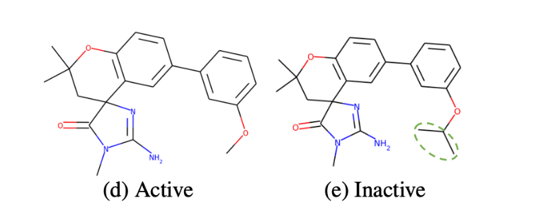
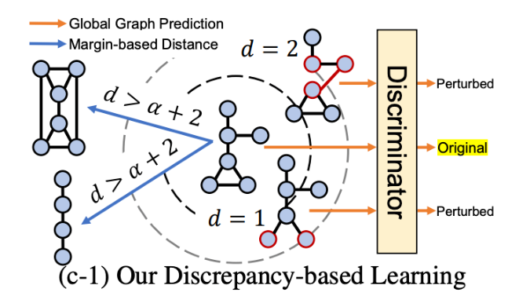
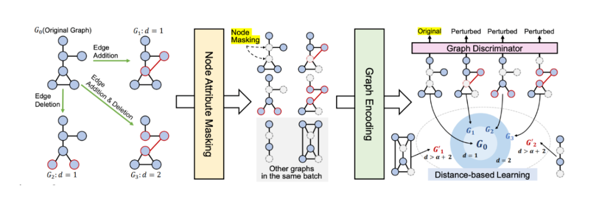
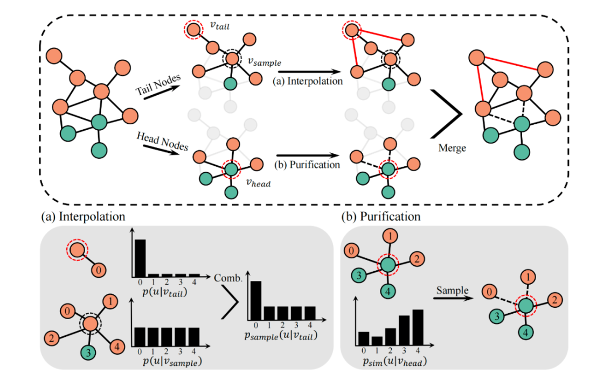

Official Accounts: 深度学习与图网络
## 2022-10-20 KDD2022: 具有节点架构的图神经网络
    来源：Proceedings of the 28th ACM SIGKDD Conference on Knowledge Discovery and Data Mining (KDD 2022)
    标题：Graph Neural Networks with Node-wise Architecture
    作者：Zhen Wang, Zhewei Wei, Yaliang Li, Weirui Kuang, Bolin Ding
    链接：https://dl.acm.org/doi/10.1145/3534678.3539387  

### 内容简介
**核心：挖掘structural information**
- background: GNN可以为新图寻找最佳架构，挖掘structural information。  
- **idea: 提出一个<mark>搜索节点的最佳GNN架构</mark>，其中参数控制器根据其局部模式决定每个节点的GNN架构。**
- problem: 现有NAS(Neural Architecture Search)方法的直接扩展将线性增加搜索空间的大小和节点数量，这使得它在大规模图上难以处理。  
- **->扩展: 彭浩在FinEvent中提出的intra-aggregator和inter-aggregator还有用来。。。**
- solution:提出一个架构，其中架构的每个方面都有一个参数控制器Aggregatioin，**Aggregator首先将节点的本地模式编码为context embedding，然后根据它从搜索空间中进行选择。**
- **conclusion: Node Resolution 可以提高GNN在大规模图上的性能。  **
- 三个方面for framework：
  - Depth，深度
  - aggregator，聚合器
  - Resolution，分辨率。即GNN采样了1-hop or 2-hop的邻居节点来聚合它们的消息。  
  - **Notice: 采样对于大图上训练GNN模型是必要的，但不同的分辨率导致不同的计算图和模型性能，2-hop不一定比1-hop要好！**  
  - **邻居采样器: 在每一跳hop中采样固定数量的节点。**
  - **在大多数情况下，采样仅用于训练而不是评估。**

problem-1: 数据集的多样性阻碍了任何基于图卷积的方法。  

problem-2: 应用相同的架构来处理所有节点可能并不令人满意。  

state-1: 因为3-hop通常无法适应GPU内存，更不用说更大的邻域了。

## 2022-10-21 KDD2022: 同时学习图结构信息和特征信息并具有鲁棒性的图神经网络GNN
    来源：Proceedings of the 28th ACM SIGKDD Conference on Knowledge Discovery and Data Mining (KDD 2022)
    标题：Reliable Representations Make A Stronger Defender: Unsupervised Structure Refinement for Robust GNN
    作者：Li Kuan, Liu Yang, Ao Xiang, Chi Jianfeng, Feng Jinghua, Yang Hao, He Qing
    链接：https://dl.acm.org/doi/10.1145/3534678.3539484  

### 内容简介
**核心：重建--边权重，探讨表征学习**
- problem: 攻击者可以通过恶意修改图结构来灾难性地降低GNN性能
- solution: 通过学习两个端节点的成对表示之间的度量函数来对边权重进行建模，该函数为对抗性边分配低权重。  
- method: STABLE的无监督pipeline来优化图结构。

### literature review
现有方法使用原始特征或GNN学习的表示来对边权重进行建模  

 problem:
- 原始特征不能表示节点的各种属性，e.g. structural information  
- GNN学习的表示可能会受到有噪声图的影响  

idea: 学习编码特征信息和结构信息，并且对结构扰动不敏感的表示  

solution: STABLE的无监督pipeline来优化图结构，最后将精细化的图输入到下游分类器中。  

### contributions of method
1). 提出了一种具有鲁棒性增强的**对比方法**来获得用于**结构细化的表示**，该方法可以有效得捕获节点的结构信息并且对扰动不敏感。  
2). 探讨了GCN缺乏鲁棒性的原因，并提出了一种更鲁棒的归一化技巧。
3). 在四个真实世界数据集上，STABLE可以防御不同类型的对抗性攻击，并优于最先进的防御模型。  

### Model Architecture
- 结构学习网络  
  - 表示学习。对比学习方法，该方法具有面向鲁棒性的图数据增强，可随机恢复去除的边。
  - 图细化。**然后根据同质假设利用学习的表示来修改结构**
- GCN分类器。通过观察对抗性边连接的节点具有那些属性，本文仔细改变了GCN中的重整化技巧以提高鲁棒性。

#### 表征学习
STABLE 通过利用与任务无关的对比方法和面向鲁棒性的增强来学习表示，从而避免前面提到缺陷。  

1). 相似度预处理。sim(中心节点vi, 邻居节点vj) -> 去掉一些扰动边perturbed graph  
2). 对比方法recover edge。**生成视图**是对比方法的关键部分。图的不同视图为每个节点提供不同的上下文，本文希望本文中的视图携带上下文以增强表示的鲁棒性。增强后图的邻接矩阵 A1 = A + E\* P  
3). 编码器遵循传播规则。Discriminator = s1\*H - s1\*H估  
4). 全局平均池化  

#### 图细化
一旦准备好高质量的embedding表示，就可以进一步细化图结构。  
底层图的强同质性可以帮助GNN在转导分类方面取得良好的性能。  
图细化：减少异性边(连接不同类)，并添加同性边(连接同一类)
- 利用对比学习编码器学习的**表示embedding representation**来测量节点相似度。
- 然后删除相似度分数低于阈值t2的节点的边 <- prune剪枝操作  

### conclusion
本文实验结果表示，当扰动率很高时，这尤其有效。

## 2022-10-25 NeurIPS 2022 | 基于精确差异学习的图自监督学习
    论文标题：Graph Self-supervised Learning with Accurate Discrepancy Learning
    收录会议：NeurIPS 2022
    论文链接：https://arxiv.org/abs/2202.02989  

**核心: **:
- **GCL继承GCN和对比学习优势 **;  
- **D-SLA旨在学习原始图和受干扰图之间的精确差异**;  
- **图本质上是离散的数据结构**->**因此即使有轻微的扰动，它们的属性也可能会完全不同**

## 内容简介
- problem: GCN常对度小节点的预测性能较差，在广泛存在的度呈长尾分布的图上表现出结构不公平。  
- solution: GCL继承GCN和对比学习优势  
- 图自监督学习最流行的两种方法：**预测学习、对比学习**。
- **预测学习**
  - 优点：可以学习相邻节点和边之间的上下文关系。  
  - 缺点：不能学习全局图级的相似性。
- **对比学习**
  - 优点：可以学习全局图级的相似性。  
  - 缺点：其最大化两个不同的受干扰的图之间的相似性的目标时，可能导致表示embedding不同区分具有不同属性的两个相似的图。  
- proposal: **D-SLA，基于差异的自我监督学习**，旨在学习原始图和受干扰图之间的精确差异。即创建具有不同相似度的给定图的多个扰动，并训练模型来预测每个图是原始图还是扰动图。

## 本文介绍
图神经网络的**自监督学习(GNNs)**旨在以无监督的方式学习图的精确表示，已获得用于各种下游任务的可转移表示。  

### contributions
- **新的图自监督学习框架，其目标与对比学习完全相反**，其目的是学习使用区分器(discriminator)区分图和受干扰的图，**因为即使是轻微的扰动也可能导致图的完全不同的属性。**  
- 为被干扰的图进行图编辑距离而无需任何额外工作，以在表示空间中保持图之间的精确差异量。
- 化学、生物、社会领域基准

## 模型介绍
图本质上是离散的数据结构，因此即使有轻微的扰动，他们的属性也可能会完全不同。

比如两个生物分子b和c，尽管他们具有高度相关的结构，但他们的分子作用完全不同。  
solution: DSLA，基于差异的自我监督学习:
- 首先像对比学习一样干扰给定的图形，但不是像对比学习那样最大化干扰图形之间的相似性，而是旨在了解他们之间的差异。
  - 首先设计一个区分器discriminator，它可以学习区分真实图形和受干扰的图. --> 这使得模型能够了解在很大程度上影响全局属性的小差异。  
  - 其次，还要知道他们之间的确切差异量，因为仅仅知道两个图不同是不够的。  

A. 基于图区分的差异学习(Discrepancy Learning with Graph Discrimination)  

### Model Framework

1. **original Graph**
2. **Node Attribute Masking**
3. **Graph Encoding**
4. **Graph discriminator**
5. **Distance-based Learning**

## 图增广
为获得更集中的增广表示，需要增加社区内边，减少社区间边。  
我们通过同时扰动原始特征和拓扑生成两个增光G1和G2，并将两增广所得节点表示记为H和O。  
为扩展尾节点邻域以包含更多相同社区的节点。  
-> 我们将锚尾节点vtail与采样所得相似节点vsample的自我中心网络插值。  
为防止增广过程中注入许多不同社区节点。  
进一步依据vtail和vsample间的相似性调整插值比率  
对于头节点，我们则利用相似性采样来提纯其邻域，尽量移除社区间边。

## conclusion
1. 无监督GCL方法比半监督的GCN方法更具有结构的公平性。
2. 为获得更集中的增广表示，需要增加社区内边，减少社区间边。
3. 至于特征增广，我们随机产生掩码向量m来隐去节点特征中的部分维度。
