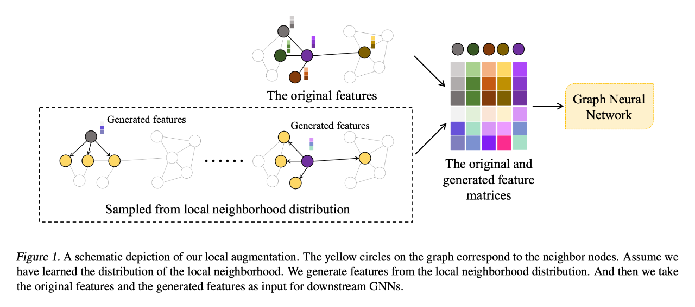

Official Accounts: PaperWeekly
## 2022-11-22 ICML2022: 图神经网络的局部增强
    来源：The 39th International Conference on Machine Learning (ICML 2022)
    标题：Local Augmentation for Graph Neural Networks
    作者：Songtao Liu, et al.
    链接：https://arxiv.org/pdf/2109.03856.pdf

### 内容简介
- background: GNN在基于图的任务中取得了显著的performance，而GNN的核心思想是通过聚集局部邻域的信息来获得节点的表示。
- problem: although GNN在局部邻域学习节点表示方面取得了进展，但局部邻域信息是否足以获得有效的节点表示仍是一个问题。
  - 特别是邻居节点数量有限的情况
  - Idea: 还有邻居节点充足的情况，是否能抽取出足够有意义的节点 <- Attention + RL
  - 或者混合情况：现实中有些节点邻居充足，有些节点邻居有限
- **Challenge：局部邻域有限的邻居节点限制了GNN的表达能力**
- solution: 高效的数据增强框架-LAGNN，局部增强是指通过基于**局部结构**以及**节点特征的生成模型**来生成邻域特征。
  - 具体而言，本文框架包括一个预训练步骤，该步骤通过生成模型学习一个中心节点的连接邻居节点特征的条件分布。(因为邻域的分布于中心节点v有关.)
  - 然后利用这个分布来生成与这个中心节点相关的特征向量，作为每次训练迭代地额外输入。

- motivation: 现有的GNN专注于设计一种消息传递方案，利用本地信息获得节点表示。本文在局部邻域中生成更多的特征，特别是对于邻居较少的节点，以增强各种GNN的表达能力。
  - 为了在v的邻域Nv中生成更多的特征，需要知道其邻域节点特征分布情况；**由于邻域的分布与中心节点v有关**，故可以通过生成模型来学习中心节点的特征。
- 针对所有节点训练单一的生成模型有三个好处：
  1. 通过生成模型学习图上所有节点的条件分布，降低了计算成本。
  2. 在生成阶段，可以应用特定节点的特征向量作为输入(条件)，生成与该节点相关的特征向量。
  3. 具有较好的可扩展性和泛化性。对于添加到动态图中的新节点，可以直接生成特征向量，而不需要重新训练新的生成模型。  

### Model Architecture
本文利用了条件变分自编码器(CVAE)，给定节点v，学习其邻居u∈Nv的节点特征分布。
  - 在训练阶段，目标是使用相邻对(Xv, Xu, u∈Nv)作为输入，使Loss最大化。
  - 在生成阶段，以节点特征Xv为条件，采样一个潜在变量z~N(0,1)作为解码器的输入。最终可得节点v的生成特征向量图片。
  - 最大似然估计MLE
  - 为了增强GNN的表达能力，本文引入了生成的节点特征\hat{X_{v}}

### conclusion
本文提出GNN上的局部增强算法，一种利用生成模型来学习给定中心节点邻居特征条件分布的新技术。
