Official Accounts: PaperWeekly
## 2023-1-3 ICML2022: GNNRank: 基于有向图神经网络从两两比较中学习全局排序
    来源：The 39th International Conference on Machine Learning (ICML 2022)
    标题：SGNNRank: Learning Global Ranking from Pairwise Comparisons via Directed Graph Neural Networks
    作者：Yixuan He, et al.
    链接：https://arxiv.org/pdf/2202.00211.pdf
    github: https://github.com/SherylHYX/GNNRank

### 内容简介
  - Background: 在分析大规模数据时，通常会寻找各种形式的数据排名(即排序)，来达到识别最重要的条目、有效计算搜索和排序操作或提取主要特征。
  - challenge: GNN在任务排名中的能力还不够完善。
    - 少数现有作品限于特定设置，例如top-n个性化推荐和近似中心性度量。
    - 另一个技术差距是无法通过直接优化排名目标来学习模型
  - solution: GNNRank框架，这是一种与现有GNN模型兼容的端到端的排名框架，能够学习有向图的节点嵌入。

## 2023-1-4 一文盘点图数据增广(Graph Data Augmentation)近期进展
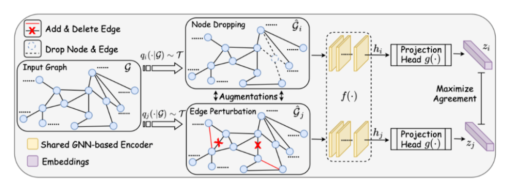
  - background: 近年来，以数据为驱动的推理在数据增广技术引入后，模型泛化能力和性能得到了显著提升。
    - 数据增广技术通过创建现有数据的合理变体而无需额外的真实标签来增加训练数据量，并且已在CV和NLP中得到广泛应用。
  -  graph data不规则和非欧结构，很难将CV和NLP的数据增广技术直接应用到图领域。
    - problem-1: 特征数据不完整。
    - problem-2: 幂律分布带来的结构数据稀疏性。
    - problem-3: 人工标注的昂贵成本导致标记数据缺乏。
    - problem-4: GNN中消息传递会导致的过度平滑。
  - Data Augmentation strategies,与图像和文本不同，graph data是连接数据，通常是非独立同分布的。无论是节点级、边级、图级别的任务，图增广数据往往会对整个图数据集做出改动。
    - node dropping
    - edge puturbation边扰动
    - attribute masking
    - subgraph sampling子图采样

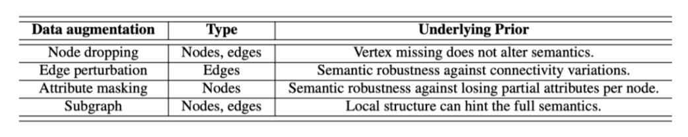

### G-Mixup: Graph Data Augmentation for Graph Classification
**新的增广策略**  
problem: 不同图有不同数量的节点、不容易对齐、在非欧几里得空间中的类型学具有特殊性  
solution: class-level的图增广方法G-Mixup。首先使用同一类中的图来估计一个graphon。然后，在欧几里得空间中对不同类的graphons进行插值，混合不同图类的graphons。基于混合graphons采样生成合成图。经过实验评估，G-Mixup显著提高了gnn的泛化性和鲁棒性。  

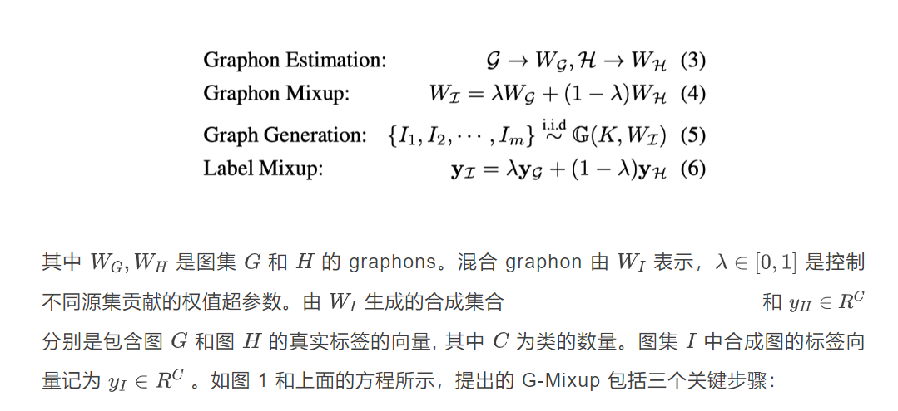

**contributions:**
  - 提出了G-Mixup来扩充用于图分类的训练图。由于直接混合图是难以处理的，因此G-Mixup将不同类别的图的图元graphon混合已生成合成图。
  - 从理论上证明合成图是原始图的混合，其中源图的关键拓扑(即判别主题)将被混合。
  - 证明了G-Mixup在各种图神经网络和数据集上的有效性。  

### AutoGCL: Automated Graph Contrastive Learning via Learnable View Generators
**自动选择增广策略的自动图对比学习方法**  
background: graph contrastive已广泛应用于图表示学习，其中**视图生成器**在生成有效对比样本方面起着至关重要的作用。  
大多数现有对比学习方法采用预定义的视图生成方法，比如node dropping或edge puturbation，通常不能很好地适应输入数据或保留原始语义结构。  
自动图对比学习(AutoGCL)新框架  
** contributions**  
  - 提出了一个图对比学习框架，其中可学习的图视图生成器嵌入到自动增广策略中。据作者所知，这是第一项为graph contrastive learning构建可学习的生成节点增广策略的工作。
  - 提出一种联合训练策略，用于在图对比学习的背景下以端到端的方式训练图视图生成器、图编码器和图分类器。
  - 本文在具有半监督、无监督和迁移学习设置的各种图形分类数据集上广泛评估了所提出的方法。t-SNE和视图可视化结果也证明了方法的有效性。

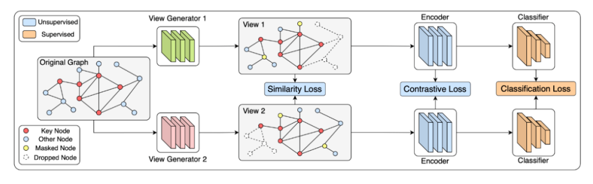

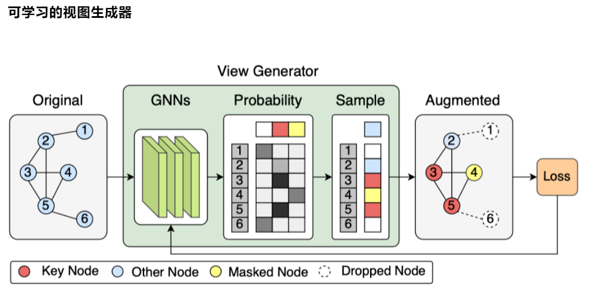   

### Bootstrapping Informative Graph Augmentation via A Meta Learning Approach
**将元学习应用到图数据增广的可学习增广方法**  
大多数增广方法都是不可学习的  
可学习的图增广因为一个“好的”图增广必须在实例级别具有一致性，在特征级别具有信息量。  
图增广器的目标是促进特征提取网络学习更具判别力的特征表示
contributions：
  - 提出可学习的方法来生成信息图扩充，称为元图扩充，它提高了图对比学习的性能。
  - 提出了一种辅助元学习方法来训练可学习的图形增广器
  - 在基准数据集上进行实验，结果证明了该方法的优越性。

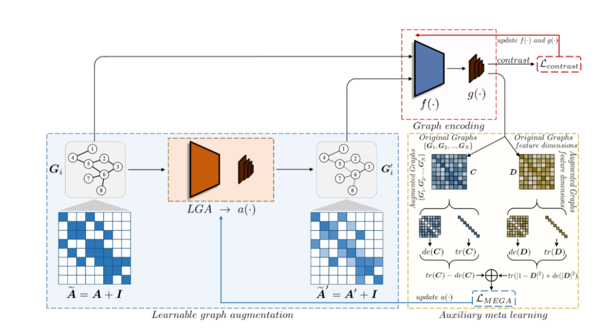

## 2023-1-5 Neural Eigenmap: 基于谱学习的结构化表示学习
    title: Neural Eigenfunctions Are Structured Representation Learners
    linkage: https://arxiv.org/pdf/2210.12637.pdf
    codes: https://github.com/thudzj/NEigenmaps  

  - 可用于自监督学习、图节点表示学习和谱聚类。
  - Eigenmaps是特征函数(eigenfunctions)的输出。这些方法基于图邻接矩阵(graph adjacency matrix)定义一个核，计算其主特征函数，并以其输出作为节点的表示，完成后续的聚类等任务。也被证明能够维持数据流形上的局部邻域结构的最优表示。

  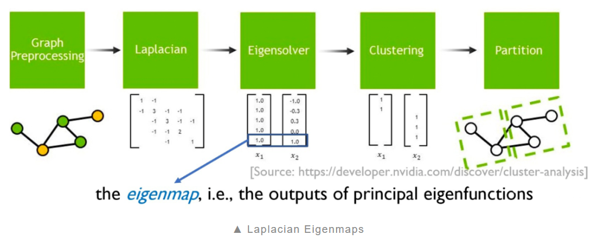

  - spectral clustering和Laplacian Eigenmaps是非参的，依赖于求解一个矩阵特征值问题得到eigenmaps，不能拓展到大规模训练数据上，也不能高效地执行样本外泛化。
  - 用神经网络作为函数逼近器来近似核函数的主特征函数。

## 2023-1-10 Graph Transformer近期进展

在graph embedding中，Graph Transformer通过位置编码对图结构信息进行编码，相比GNN可以捕获长距离依赖，减轻过平滑现象。  

### ICML 2022: Structure-Aware Transformer for Graph Representation learning
  - 本质：改进Transformer位置编码
  - problem: 使用位置编码的Transformer生成的node embedding不一定捕获它们之间的结构相似性。
  - solution: 结构感知Transformer。通过设计新的self-attention mechanism，使其能够捕获到结构信息。新的注意力机制通过在计算注意力得分之前，**提取每个节点的subgraph表示**，并将结构信息合并到原始的self-attention mechanism中。
  - 自动生成subgraph的方法：从理论上证明，生成的embedding至少与子图表示具有相同的表达能力。
    - k-subtree GNN extractor
    - k-subgraph GNN extractor  

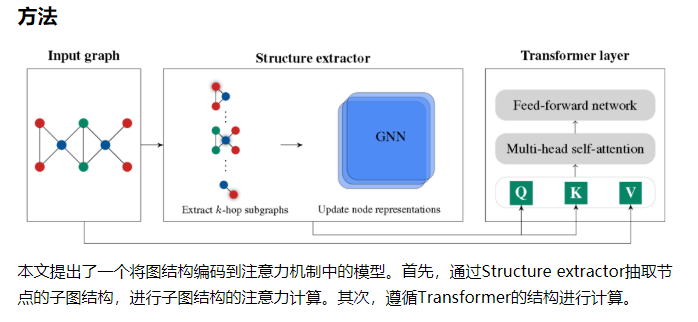

#### structure-Aware Self-attention

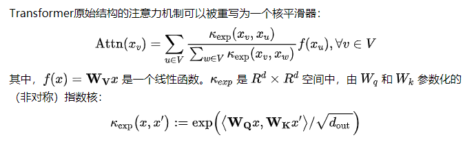

Kexp是定义在节点特征上的可训练指数核函数，这就带来了一个问题：当节点特征相似时，结构信息无法被识别并编码。
为了同时考虑节点之间的结构相似性，我们考虑了一个更一般化的核函数，额外考虑了每个节点周围的局部子结构。通过引入以每个节点为中心的一组子图，定义**结构感知注意力**如下：

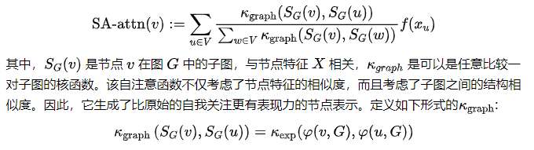

### NIPS 2022: Recipe for a General, Powerful, Scalable Graph Transformer

  - 编码类型：局部编码、全局编码、相对编码。
  - 模块化框架GraphGPS，支持多种类型的编码
  - 框架由位置/结构编码、局部消息传递机制、全局注意力机制三部分组成。
    - 位置/结构编码是影响Graph Transformer性能的最重要因素之一。
  - problem:现有MPNN+Transformer混合模型往往是MPNN和Transformer层逐层堆叠，由于MPNN固有结构带来的过平滑问题，导致这样的混合模型的也会收到影响。
  - solution: 新的混合模型，使MPNN和Transformer计算相互独立，获得更好的性能。

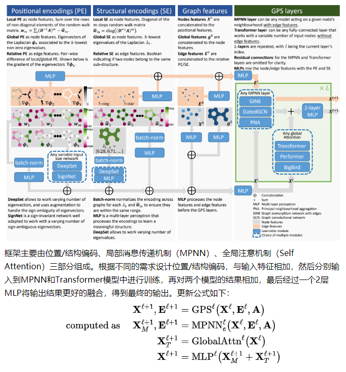

### 总结
GNN + Transformer混合模型。GNN学习到的图结构信息，然后在Transformer的计算中起到提供结构信息的作用。

## 2023-1-11 Neural 2022: 大图上线性复杂度的节点级Transformer
    title: NodeFormer: A Scalable Graph Structure Learning Transformer for Node Classification
    address: https://openreview.net/pdf?id=sMezXGG5So
    github: https://github.com/qitianwu/NodeFormer  

  - background: GNN目前已成为对图结构数据建模和embedding表征的主流范式。
  - challenge: GNN"沿着固定输入图结构进行信息传递"的设计思想暴露了诸多不足。
    - problem-1: 由于每层聚合只考虑相邻节点间的消息传递，这种有限的感受野(receptive field)设计使得GNN无法有效利用来自其他相邻节点的全局信息
    - problem-2: 在很多下游任务中，输入数据可能并不包含图结构(比如图片分类任务中，每张图片样本是独立的)，此时GNN对输入图结构的依赖性导致其无法正常工作。
  - solution: NodeFormer，新的图表正模型架构，它实现了每层任意两两节点间的信息传递，即在每层的信息聚合中会考虑所有其他节点对当前节点的影响。
  - NodeFormer设计思想的直观理解就是把GNN定义在了一个两两节点潜在相连且每层的图拓扑可学习的计算图上
  - 这种简单的设计思想带来令人望而却步的计算复杂度(节点数目的平方及复杂度O(N^{2}))    
  - 一种具有线性复杂度的可变图结构信息传递方法，并首次成功扩展到了百万级规模的节点分类图上，这一方法还能被用于处理没有输入图的问题。  

### 研究背景
来源于GNN设计思想"沿着固定输入图结构进行信息传递"的问题和局限性  
GNN在图数据建模任务上的不足：
  - GNN对于图中"遥远"的节点会过度挤压(over-squashing)，在聚合过程中稀释掉这部分信息
  - GNN有限的感受野使其难以捕捉长距离依赖(long-range dependence)
  - GNN聚合邻居信息的设计不能很好地兼容异配关系(heterophily)或连边残缺的图
  - 在极端的没有输入图的情况下，GNN无法正常工作  

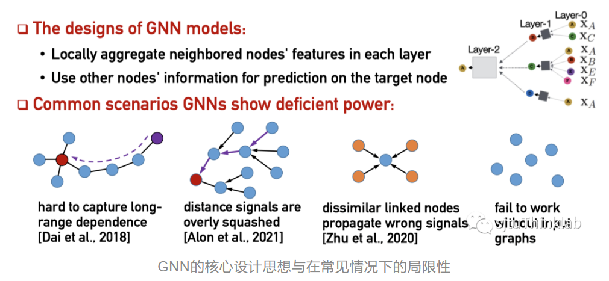

### 大规模图结构学习的技术挑战
要学习一个全新的图结构，实现两两节点间的信息传递是非常困难的，尤其对于大规模的图。
主要有以下两点挑战：
  - 可扩展。O(N^{2})的计算复杂度，对于大规模图的信息传递时非常棘手的。
  - 可微分。图结构本身是离散的，当考虑对图结构进行优化时一种理想的情况是能实现端到端的梯度更新，此时要求对图结构的学习的可微分的。  

### NodeFormer: 可扩展的节点级Transformer
NodeFormer就是将Random Feature Map[1]和Gumbel-Softmax[2]两种近似策略有机融合，并提供了理论保障分析，从而实现了线性复杂度O(N)下大规模信息传递图结构的学习。

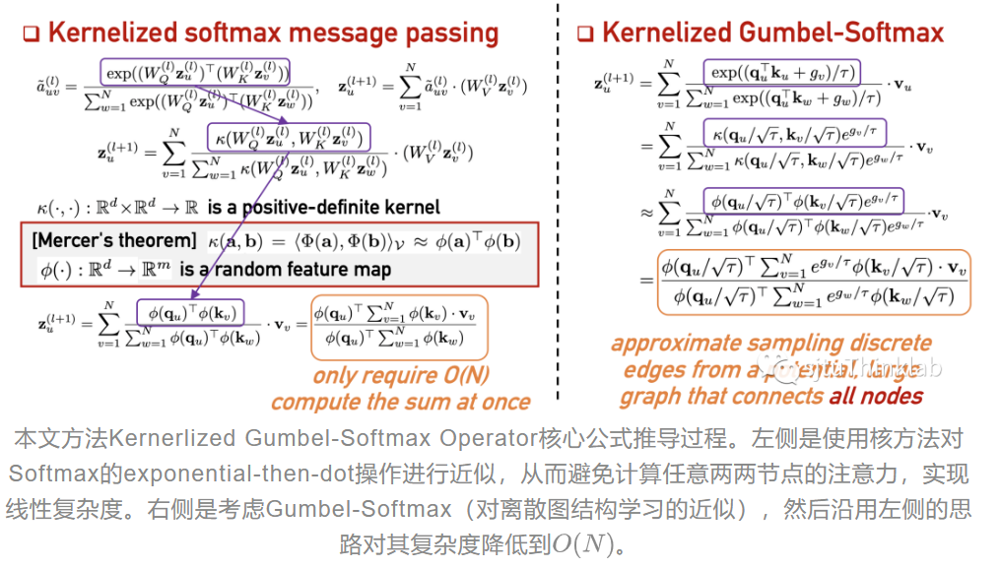

### Reference
[1] Ali Rahimi and Benjamin Recht. Random features for large-scale kernel machines. In Advances in Neural Information Processing Systems, pages 1177–1184, 2007.

[2] Eric Jang, Shixiang Gu, and Ben Poole. Categorical reparameterization with gumbel-softmax. In International Conference on Learning Representations, 2017.

## 2023-1-13 推荐系统中稀疏特征Embedding的优化表示方法

推荐系统CTR任务，即Click Through Rate点击率任务。
  - background: 海量稀疏特征。海量意味着数量巨大，稀疏意味着即使在很大的训练数据里，大量特征出现频次也非常低。
  - significance: 如何更好地表征稀疏特征对模型的泛化能力至关重要。
  - thinking: 除了经典的特征onehot-> 稠密embedding映射模式外，另外的embedding模式并未太受到重视。
    - 拥有怎样性质的embedding表达方式是较好的？
    - embedding size作为超参，常规做法是通过手工测试来寻找更好的embedding大小，是否有更好的方式？  

### 用户行为序列中的item embedding
  - 用户行为是推荐系统中很有价值的可利用信息，可以将用户实施过的行为作为某个用户兴趣的表征。
  - Res-embedding for Deep Learning based click-through rate prediction modeling
  - 理论证明：神经网络CTR模型的泛化误差与item在embedding空间的分布密度相关。即模型泛化误差越小，模型的泛化能力越好。
  - 结论：在训练过程中约束item embedding

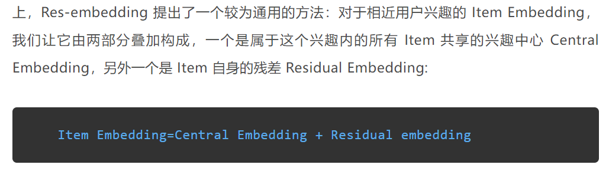

### 非行为序列类推任务中的特征embedding

  - 对于高频出现的特征，分配给它较长的embedding大小，使其能够更充分的编码和表达信息。
  - 对于低频的特征，则分配较短的embedding。因为低频特征在训练数据中出现次数较少，如果分配较长的embedding，容易出现过拟合，影响模型泛化性能。
  - 对于极其低频的特征，基本学不了什么特征，反而会带来各种噪音，那么可以不分配或让它们共享一个公有embedding即可。  
  - google, Neural Input Search for Large Scale Recommendation Models(NIS)用强化学习来实现这一目标。

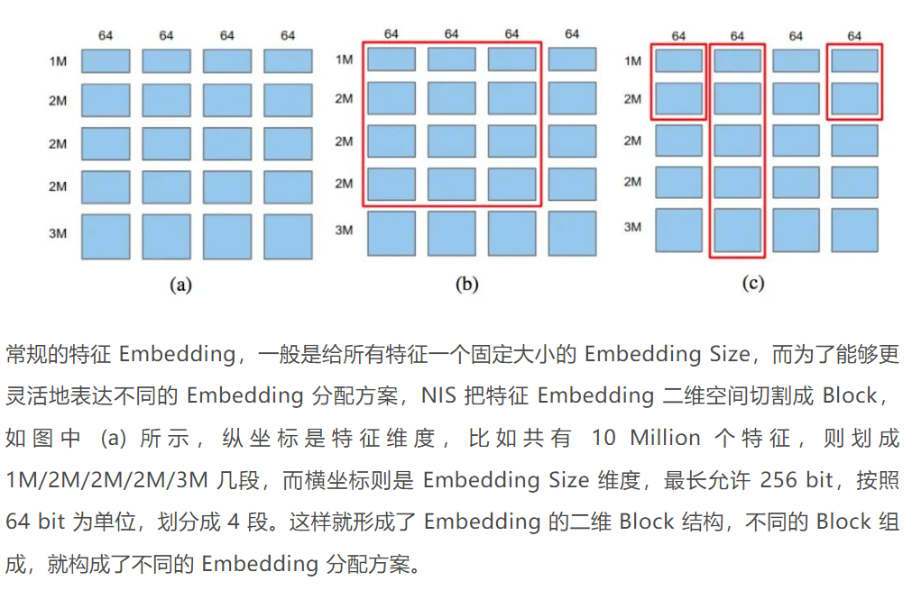

## 20230116 NeurIPS 2022-在静态属性图上对无监督异常节点检测进行基准测试
    title: BOND: Benchmarking Unsupervised Outlier Node Detection on Static Attributed Graphs
    link: https://arxiv.org/abs/2206.10071
    github: https://github.com/pygod-team/pygod/tree/main/benchmark

  - 第一个静态属性图上无监督异常节点检测的综合基准测试，BOND
    - 从traditional 矩阵分解到 state-of-the-art 图神经网络中的14种异常节点检测方法的性能进行了测试。
    - 在9个真实数据集上进行测试，benchmark评估了不同的检测技术对两个主要异常类型的检测结果，即**人造异常**和**自然异常**(即真实非人造异常)。
    - 使用现有的随机图生成技术生成了一组不同大小的合成图数据集，使我们能够比较不同异常检测算的运行时间和内存使用情况。
    - 讨论了现有的图异常检测算法的优缺点，并强调了未来可能的研究方向。**代码开源**

### Introduction
  图异常检测是指识别图中哪些节点是异常的。如，社交网络中垃圾邮件发送者检测、传感器故障检测、金融诈骗犯、防御图对抗攻击。  
  与经典的表格数据和时间序列数据上的异常检测不同，图异常检测面临着额外的挑战：  
  - 图结构数据通常携带更加丰富的信息，因此需要更强大的机器学习模型来学习信息表示。
  - 如果使用更加复杂的机器学习模型，在训练时运行时间和内存消耗方面的计算成本都会更高，这对时间关键性(即低时间预算)和资源敏感型(即有限的GPU资源)应用程序提出了挑战。  

  OND问题的目标是学习一个函数f: V->R, 该函数为G中的每一个节点分配一个实值的异常分数。然后对于用户指定的k值，选择异常分数最高的k个节点作为异常节点。这是一个无监督的问题, 因为在学习函数f的过程中, 我们没有任何关于哪些节点是否异常的基础真实信息.

  - PyGOD，创建了一个用于图异常检测的开源python库。它提供了数十种最新的图异常检测算法，并且有统一的API和优化算法。
    - 第一个全面的节点级图异常检测基准。
    - 异常节点的统一分类方法。结构(structure)异常和上下文邻域(context)异常
    - 发现了所有深度图异常检测方法存在的系统性能缺陷。大多数经过基准测试的深度图异常检测方法在对自然异常的检测上没有达到理想性能。
    - 同时评估检测质量和计算效率。除了常见的性能评估指标(ROC-AUC)，还测量了不同算法的运行运行时间和GPU内存消耗作为其效率度量。
    - 可重复性和可访问的基准测试工具包。  

### Related Work
#### 经典的(非深度)异常节点检测
  - 中心性度量和聚类系数。
  - 基于学习的方法: 矩阵分解(MF)，基于密度的聚类，关系学习的方法。SCAN、Radar、ANOMALOUS方法
#### 深度异常节点检测
  - 自动编码器，Auto-Encoder。其通过尝试从编码中重建原始数据来学习原始数据的编码，现已成为检测异常节点的常用模型。、
    - AE可以以无监督方法学习，因为目标是重建原始数据，所以不需要单独尝试预测标签。
    - 背后原理：使用AE重构误差作为异常分数，具有较高重构误差的数据点将更有可能是异常。
    - GNN的目标是学习图中每个节点的编码表示，并考虑到节点属性和底层的图结构。GNN与AE结构，在构建AE时，可以设置GNN作为指定编码器和解码器网路，其学习到的编码表示可以体现对异常检测有用的复杂模式。  
  - GAN，生成对抗网络。通过通同时学习生成器网络(用于随机生成假数据)和鉴别器网络(试图判断一个数据点是真实的还是假的)来生成类似于真实数据的假数据。

### BOND

#### 异常类型
结构异常和上下文异常
- 结构异常是密集连接的节点，而不是稀疏连接的规则节点。
- 邻域异常是指其属性与相邻节点有显著不同的节点。
  - 邻域异常之前也被称为属性异常和社区异常。图论中“社区”术语通常是指节点间边的边密度。
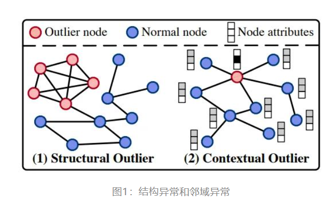

### conclusion
- 对于GNN，结构信息的重构在检测结构异常方面发挥了重要作用。
- 低阶结构信息(即1-hop一跳邻居)足以检测结构异常。
- 没有一种方法对结构异常和邻域异常都能达到较高的检测精度。 例如，没有一种方法对结构异常和邻域异常检测的ROC-AUC能同时达到85%。
